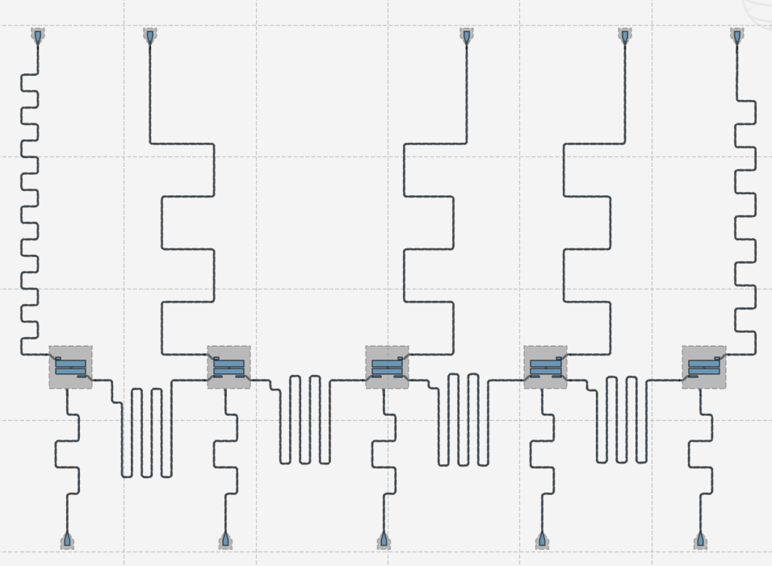
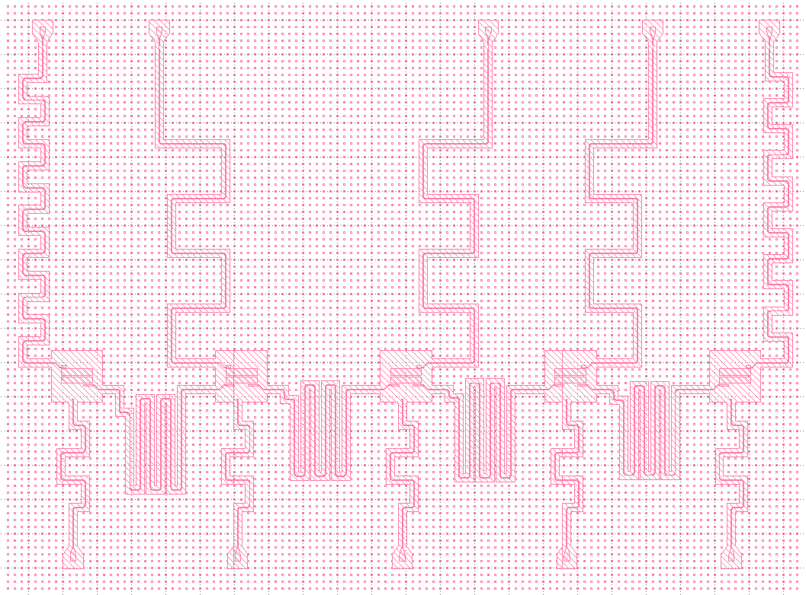
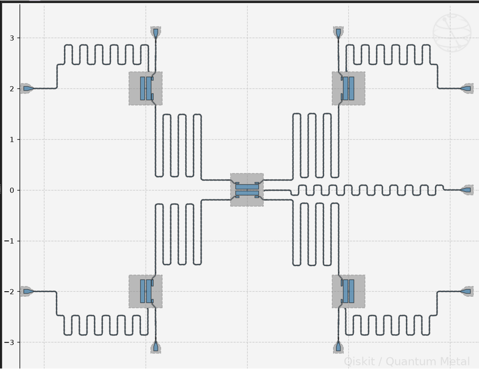
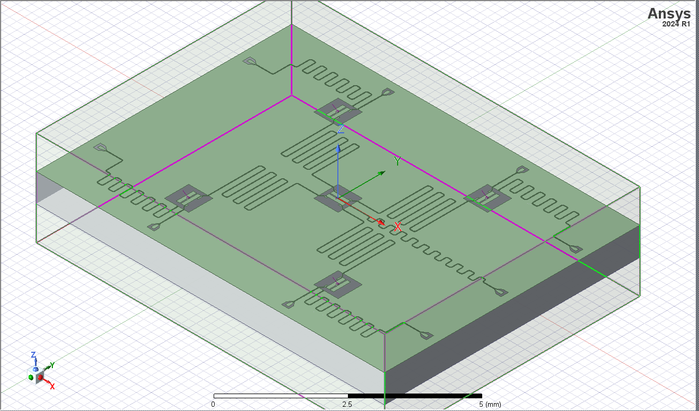
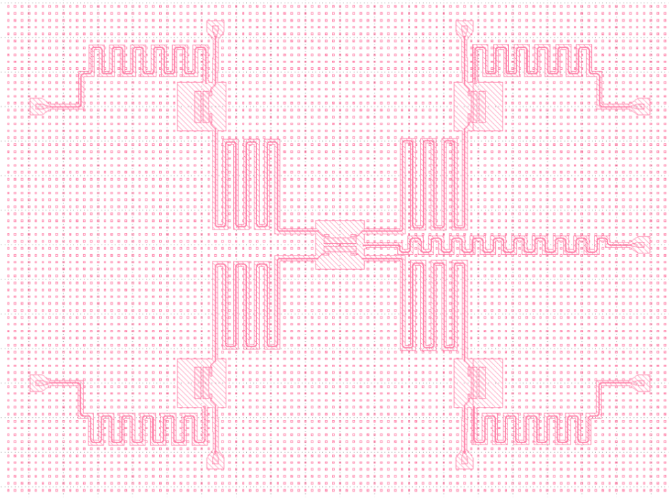
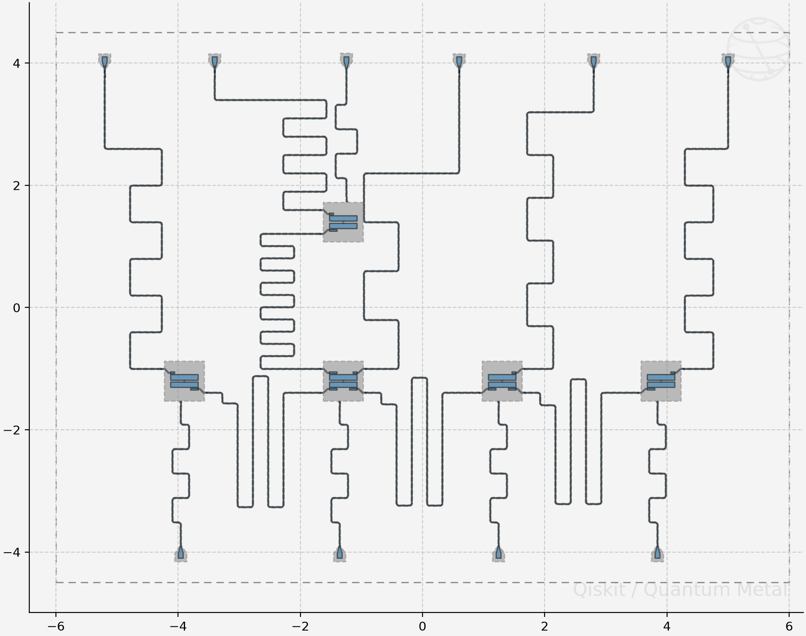
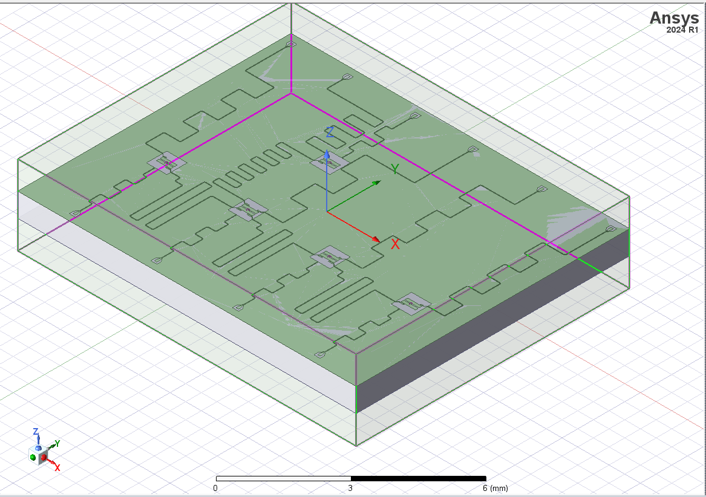

# cinQubit
## Designing & optimizing a 5-qubit superconducting chip

[](https://qiskit-community.github.io/qiskit-metal/)
[](https://www.ansys.com/products/electronics/ansys-hfss)
[](https://www.klayout.de/)
[](https://202q-lab.github.io/QDesignOptimizer/)

Alexandria Quantum Hackathon - 4th place

## Problem Statement

Designing a superconducting quantum chip is not just "placing qubits on a die" — it is a multi-constraint joint engineering problem.
Physical layout, electromagnetic (EM) behavior, connectivity topology, and fabrication rules all interact heavily. A poor design choice degrades qubit coherence, increases crosstalk, or makes a chip physically unroutable.

Our goal: explore how topology choice, qubit pitch, and transmon geometry interact, and use that to make a workload-aware fabrication recommendation.

## Approach

Design -> Check -> Sweep -> Compare -> Recommend

- Qiskit Metal
- DRC rules
- Pitch routing, crossings
- Score 1.5-2.5 mm workload fit

| Stat | Value |
|---|---|
| Qubits | 5 |
| Topologies built | 3 |
| Pitch sweep range | 1.5 - 2.5 mm |
| DRC violations | 0 |
| Coupler crossings | 0 |

## Topologies

### Topology A — Linear Chain
**Best for: Quantum Fourier Transform (QFT)**


*(Klayout:)*


The manufacturable baseline — single-layer routing, no extra process steps.
Linear chains support QFT because each qubit interacts only with its neighbor, exactly matching the QFT's sequence of adjacent controlled-phase gates. The QFT circuit needs only nearest-neighbor interactions (Hadamard + controlled-phase gates between adjacent qubits), so a linear topology physically mirrors the algorithm — no long-range connections required.

| Metric | Value |
|---|---|
| Fabrication score | 195.3 |
| Coupler crossings | 0 |
| Airbridges | 0 |
| Longest coupler | ~8 mm |

### Topology B — Star (Hub)
**Best for: GHZ State Distribution**


*(3D Render:)*

*(Klayout:)*


Star topology distributes GHZ states: the central hub entangles with all leaf nodes at once, creating a multi-party state shared across the entire network.
The hub is the natural GHZ source — it establishes entanglement with every leaf simultaneously, producing the state |000…> + |111…> shared by all nodes. Ideal for quantum secret sharing, networked sensing, and distributed consensus.

| Metric | Value |
|---|---|
| Fabrication score | 168.4 |
| Coupler crossings | 0 |
| Airbridges | 0 |
| Longest coupler | ~10 mm |

### Topology C — T-Shape
**Best for: Variational Quantum Eigensolver (VQE)**


*(3D Render:)*


Aims to combine star connectivity with linear manufacturability.
T topology parallelizes VQE: each branch measures different Pauli terms of the Hamiltonian, and the junction node aggregates them into the total energy. VQE needs the expectation value of H = Sum(hi Pi). The Pauli terms split into commuting groups that can be measured in parallel — the T topology assigns each branch a commuting group, the junction collects partial energies, sums them, and the classical optimizer updates the ansatz parameters each iteration.

| Metric | Value |
|---|---|
| Fabrication score | 250.7 |
| Coupler crossings | 0 |
| Airbridges | 0 |
| Longest coupler | ~9 mm |

## EM Analysis Workflow

Target f01 -> Sweep geometry -> Simulate (HFSS) -> Verify
4.8 GHz -> pad width 355-555 um -> eigenmode readout ~8 GHz -> C = 100.4 fF (+0.6% shift), Lj = 10 nH

### Transmon Pocket Results

| Qubit | f01 | a (anharmonicity) | Reason |
|---|---|---|---|
| Q1 | 4.829 GHz | -193 MHz | 2 connection pads |
| Q2 | 4.553 GHz | -171 MHz | 3 pads |
| Q3 | 4.829 GHz | -193 MHz | 2 pads |
| Q4 | 4.829 GHz | -193 MHz | 2 pads |
| Q5 | 4.320 GHz | -153 MHz | 4 pads (hub) |

HFSS verification (455 um pocket):
- Lj = 10 nH (assumed Josephson inductance)
- C_sum = 100.4 fF (island capacitance from drawn geometry)
- f01 = 4.829 GHz vs target 4.8 GHz -> +0.6% shift (within Lj tuning range)
- a = -193 MHz (healthy transmon anharmonicity)

### Readout Resonators

All five readout channels placed above 8 GHz, spaced ~150 MHz apart — enabling fast, collision-free multiplexed readout.

| Resonator | Length (mm) | Frequency (GHz) |
|---|---|---|
| bus_Q1_Q5 | 10.50 | 5.733 |
| bus_Q5_Q2 | 9.90 | 6.081 |
| bus_Q2_Q3 | 10.20 | 5.902 |
| bus_Q5_Q4 | 9.60 | 6.271 |
| ro_Q1 | 7.24 | 8.315 |
| ro_Q5 | 7.12 | 8.455 |
| ro_Q2 | 7.00 | 8.600 |
| ro_Q3 | 6.88 | 8.750 |
| ro_Q4 | 6.76 | 8.905 |

Resonator length formula: L = c / (2 * f * sqrt(e_eff)) — half-wave open-open CPW, e_eff approx 6.2 on silicon.

## Optimization

### Cost Function
C = M_total + 2*M_max + 4*A + 10*(M_total / A) + 1000*N_crossings + 1000*N_invalid

Where:
- M_total — total meander length
- M_max — longest single meander
- A — chip area
- N_crossings — number of coupler crossings (hard penalty)
- N_invalid — DRC violations (hard penalty)

### Parameter Sweep Results
- Cost trend: rises linearly with qubit pitch
- DRC constraint: edge keep-out violation occurs at 3.5 mm pitch
- Optimal pitch: 1780 um — minimum cost 168.40, lowest DRC-valid pitch overall

## Head-to-Head Comparison

| Metric | Linear | Star | T-shape |
|---|---|---|---|
| Fabrication score (lower better) | 195.3 | 168.4 | 250.7 |
| Coupler crossings | 0 | 0 | 0 |
| Airbridges needed | 0 | 0 | 0 |
| Longest coupler | ~8 mm | ~10 mm | ~9 mm |
| Best workload | QFT | GHZ / secret sharing | VQE |

### Recommendation: Fabricate the Star
Workload-driven choice — 4.8 GHz per qubit, DRC-clean, 0 violations.

Next steps:
- Build & sweep remaining star parameters
- Full EM analysis in Ansys HFSS for all 5 qubits
- Tape-out prep: GDS export & rule sign-off

---

## Repository Structure & Source Code

| File | Description |
|---|---|
| `design.py`, `design_star.py` | Full Qiskit Metal layouts for the linear chain and star topologies. |
| `names.py`, `names_star.py` | Mode definitions mapping quantum identifiers to Qiskit Metal components. |
| `parameter_targets.py` | Target frequencies, anharmonicities, dispersive shifts, and kappa values. |
| `cost_function.py` | Topology cost and Frequency cost evaluators based on the equations above. |
| `design_rules.py` | Design Rule Check (DRC): verifies minimum qubit-to-qubit spacing and edge keep-out zone compliance. |
| `parameter_sweep.py` | Sweeps qubit pitch, computes the cost function, checks DRC, and plots convergence. |
| `comparison.py` | Builds a structured comparison table of topology candidates. |

## Environment Setup

**Requirement:** Python 3.10 (qiskit-metal does not support Python 3.11+).

```bash
# Create virtual environment
python3.11 -m venv .venv

# Activate (PowerShell)
.\.venv\Scripts\Activate.ps1

# Install dependencies
pip install --upgrade pip setuptools wheel
pip install qdesignoptimizer

# Register Jupyter kernel
pip install ipykernel
python -m ipykernel install --user --name=qdesign-5qubit --display-name "Python 3.11 (QDesign 5-Qubit)"
```

Note: Do not install both PySide2 and PySide6 in the same environment, as their Qt shared libraries conflict and cause kernel crashes.

## Tools & Stack

| Tool | Purpose |
|---|---|
| [Qiskit Metal](https://qiskit-community.github.io/qiskit-metal/) | Qubit & resonator layout design |
| [Ansys HFSS](https://www.ansys.com/products/electronics/ansys-hfss) | Full-wave EM simulation & eigenmode analysis |
| [KLayout](https://www.klayout.de/) | GDS layout viewing & DRC |
| Python / NumPy / Matplotlib | Cost function, sweep scripts, visualization |

## References

- N. M. Linke et al., "Experimental comparison of two quantum computing architectures," PNAS, vol. 114, no. 13, pp. 3305-3310, 2017.
- P. Krantz et al., "A quantum engineer's guide to superconducting qubits," Applied Physics Reviews, vol. 6, no. 2, Art. no. 021318, 2019.
- N. Elsayed Amer et al., "On the optimality of quantum circuit initial mapping using reinforcement learning," EPJ Quantum Technology, vol. 11, Art. no. 19, 2024.
- F. S. Anim and M. S. Rahman, "End-to-end design flow for 4-qubit superconducting quantum chip," QPAIN 2025.
- A. M. Eriksson et al., "QDesignOptimizer based on ANMod," Quantum Science and Technology, vol. 11, no. 3, Art. no. 035024, 2026.
- M. AbuGhanem, "Early IBM quantum computers: architectural analysis and performance benchmarks," The Journal of Supercomputing, vol. 82, Art. no. 422, 2026.

## Acknowledgements

Organized by the Alexandria Quantum Hackathon, supported by:
- [Bibliotheca Alexandrina](https://www.bibalex.org/)
- [Open Quantum Institute (OQI)](https://open-quantum-institute.cern/)
- [Fixed Solutions](https://www.fixed.com.eg/)
- [iQafe](https://iqafe.com/)
- [MolKet](https://molket.io/)

## Team
- [Jannah Ahmed](https://www.linkedin.com/in/jannah-abdelmawla/)
- [Abdelwhab Mohamed](https://www.linkedin.com/in/abdelwhab-mohamed-a42534243)
- [Mohamed Adel](https://www.linkedin.com/in/mohamed-adel2005/)
- [Shahd Elgouhary](https://www.linkedin.com/in/shahdelgouhary/)
- [Maya Mahmoud](https://www.linkedin.com/in/maya-anber/)

## Our Amazing Mentors
- [Menna Zaied](https://www.linkedin.com/in/menna-zaied-3434a52a3/)
- [Youssef Khaled](https://www.linkedin.com/in/youssif-khalid-654b872a5/)
